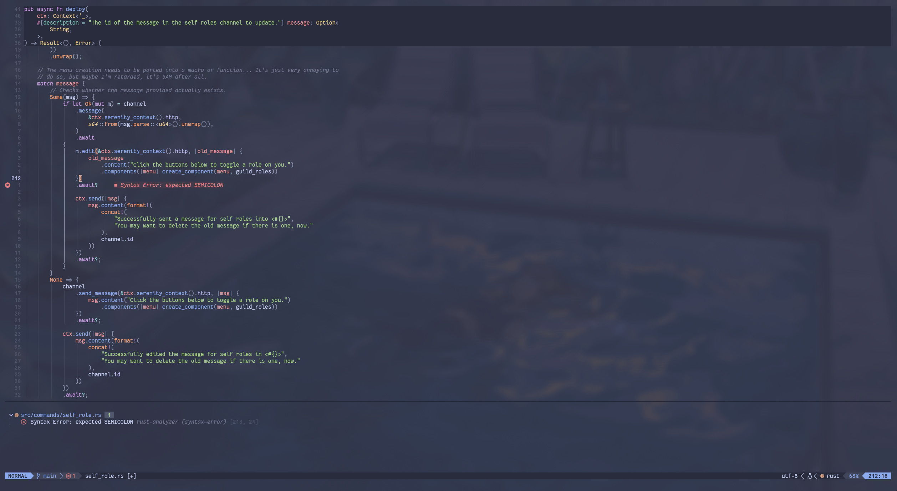
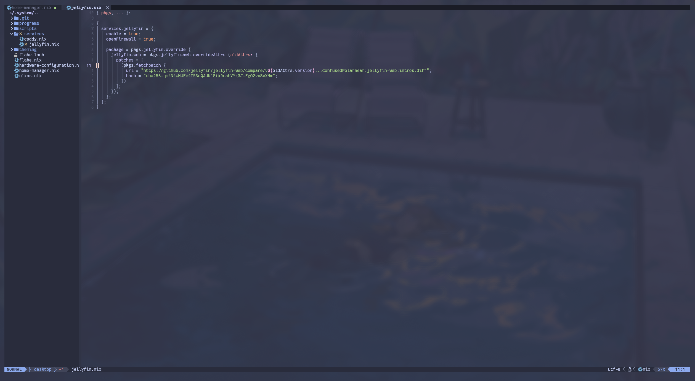

# My nix based neovim configuration

This is my personal configuration for _[neovim]_ using [Nix](https://nixos.org/), so this will not work outside of it - though it can be made to be.

Specifically I am using [`nixvim`](https://github.com/nix-community/nixvim) for configuring everything, it's very much helpful to keep it reproduceble and the code short.

## Installing

The configuration is made in a way that can be used anywhere with a single line:

```sh
nix run github:wizardlink/neovim
```

This way there is no need for configuring the system to have it as a package or to mess with a pre-existing configuration and installation of _[neovim]_.

### As a package

To install this as a package you can add this repository as a flake:

```nix
{
  # ...
  inputs = {
    # ...
    wizardlink-neovim.url = "github:wizardlink/neovim";
  };


  outputs = { self, nixpkgs, home-manager, wizardlink-neovim } @ inputs: {
    nixosConfigurations.nixos =
      let
        system = "x86_64-linux";

        # *IF* you don't use home-manager
        # or want NixOS to be the one managing it.
        specialArgs = inputs;

        modules = [
          # *IF* using home-manager.
          home-manager.nixosModules.home-manager
          {
            home-manager.extraSpecialArgs = inputs;
            # ...
          }
        ];
      in
      nixpkgs.lib.nixosSystem { inherit system specialArgs modules; };
  }
  # ...
}
```

Then you can add `wizardlink-neovim.packages.${pkgs.system}.default` to your packages in `home-manager` or NixOS. For example in `home-manager`:

```nix
{ pkgs, wizardlink-neovim, ... }:

{
  home.packages = with pkgs; [
    wizardlink-neovim.packages.${system}.default
  ];
}
```

### Changing the configuration

If you want to change the configuration to suit your needs, all the configuration spawns from `./config/default.nix`, if you're new to the syntax I recommend [reading this official guide](https://nixos-and-flakes.thiscute.world/the-nix-language/) first.

Once you've done your changes you can execute `nix run` to test out your changes! Don't forget to push it into your own fork and change the flake input!

## How it looks

Here's some screenshots of how it currently looks like:





The theme I'm using is [catppuccin](https://github.com/catppuccin) in case you're curious.

<!--
To anyone reading this and seeing the MD013/line-length errors...
Since GitHub has word warping it isn't a problem so I'll ignore them, feel free not to ignore them though. Haha
-->

[neovim]: https://neovim.io/
